# GitOps Pipeline Documentation

Welcome to the documentation for setting up a GitOps pipeline using Argo CD and Argo Rollouts! This guide will walk you through the process of automating the deployment and management of a simple web application in a Kubernetes environment. Whether you're a technical expert or new to these concepts, this documentation aims to provide clear and understandable instructions.

Click here to see the [docker image](https://hub.docker.com/repository/docker/deepanshurawat6/flask-frontend/general) of the application. Also here is the follow up [argo-configs](https://github.com/deepanshu-rawat6/flask-frontend-configs) repository.

## Table of Contents

1. [Setup and Configuration](#setup-and-configuration)
2. [Creating the GitOps Pipeline](#creating-the-gitops-pipeline)
3. [Implementing a Canary Release with Argo Rollouts](#implementing-a-canary-release-with-argo-rollouts)
4. [Documentation and Cleanup](#documentation-and-cleanup)

## 1. Setup and Configuration <a name="setup-and-configuration"></a>

### 1.1 Create a Git Repository

To get started, we create a GitHub repository to host the source code of our web application. This is where we'll store all the files needed for deployment.

Frontend Service:

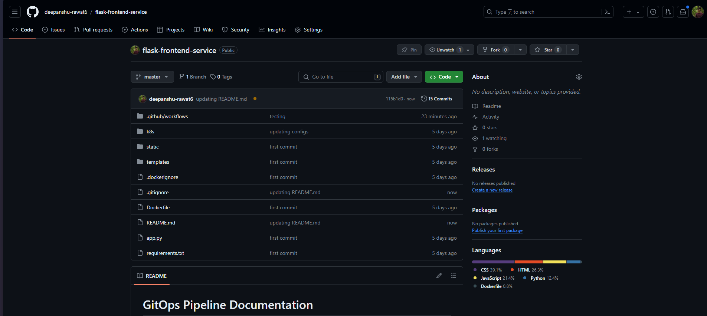

Frontend Configs:

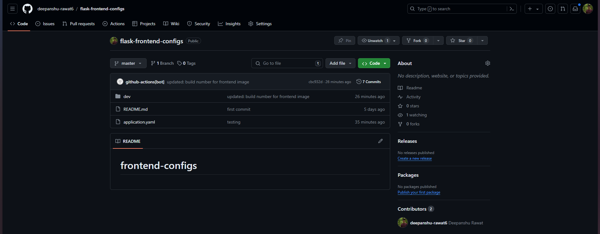

### 1.2 Setting up : Minikube Cluster

Minikube is local Kubernetes, focusing on making it easy to learn and develop for Kubernetes. We have used default driver as `docker`, with configuration again set to default.

```zsh
minikube start
```

Before working with minikube, make sure you have kubectl installed on your system, [click here](https://kubernetes.io/docs/tasks/tools/install-kubectl-linux/) and follow steps to install the latest version of kubectl.

### 1.2 Install Argo CD

Argo CD is a tool that helps us manage our Kubernetes applications using Git repositories. We follow the instructions in the official documentation to install and configure Argo CD on our Kubernetes cluster. This allows us to automate deployments based on changes to our Git repository.

First, create ArgoCD namespace :

```zsh
kubectl create namespace argocd
```

To check for the newly created namespace :

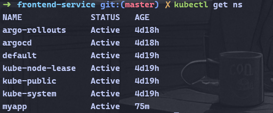

Then, install the lastest version of ArgoCD :

```zsh
kubectl apply -n argocd -f https://raw.githubusercontent.com/argoproj/argo-cd/stable/manifests/install.yaml
```

Check ArgoCD deployments :

```zsh
kubectl get all -n argocd 
```

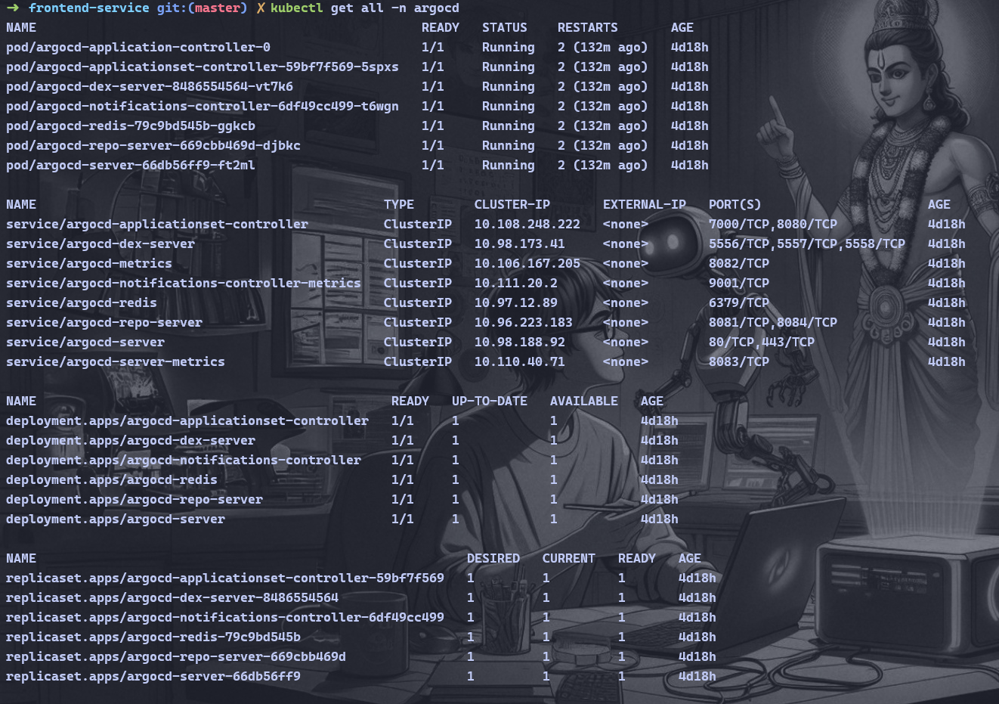

Now, lets visit the ArgoCD API Server, but first we need to extract the default password for authentication.

```zsh
kubectl -n argocd get secret argocd-initial-admin-secret -o jsonpath="{.data.password}" | base64 -d; echo
```


To access the API Server, we need to port forward(expose) the service to `localhost:8080`.

```zsh
kubectl port-forward svc/argocd-server -n argocd 8080:443
```

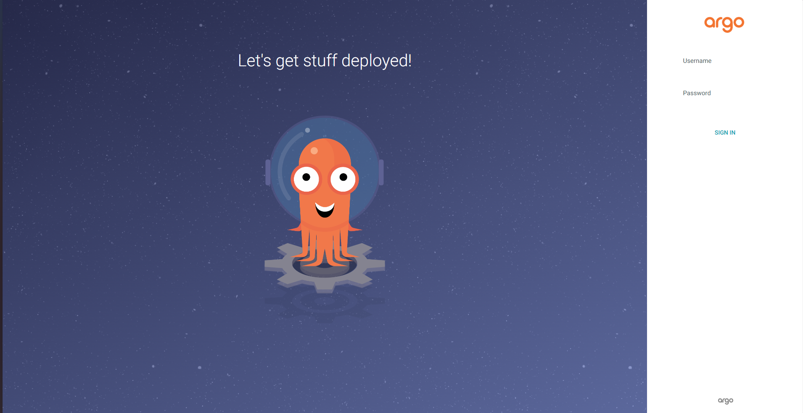


### 1.3 Install Argo Rollouts

Argo Rollouts is an extension of Argo CD that allows for advanced deployment strategies, such as canary releases. We install the Argo Rollouts controller in our Kubernetes cluster by following the provided guide.

First, create Argo Rollouts namespace

```zsh
kubectl create namespace argo-rollouts
```

To check for the newly created namespace


Then, install the lastest version of ArgoCD

```zsh
kubectl apply -n argo-rollouts -f https://github.com/argoproj/argo-rollouts/releases/latest/download/install.yaml
```

To access the Argo Rollout Dashboard, hit the command given below:

```zsh
kubectl argo rollouts dashboard
```


Here the dashboard, don't worry about the empty screen, we will create some rollouts in the further steps:

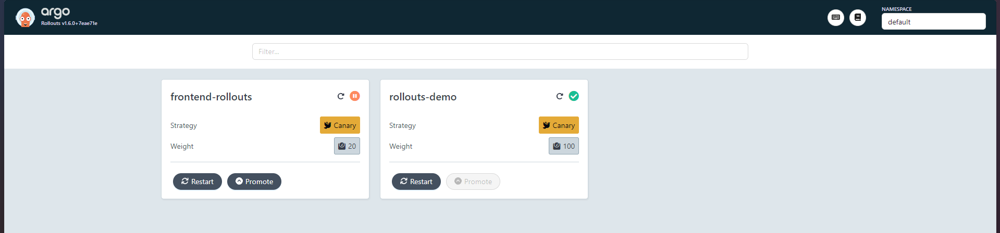

## 2. Creating the GitOps Pipeline <a name="creating-the-gitops-pipeline"></a>

GitOps is a methodology for managing and automating infrastructure and application deployments using Git as the single source of truth. In a GitOps pipeline, all configurations, definitions, and scripts required for deployment are stored in a Git repository.

### 2.1 Dockerize the Application

We containerize our web application using Docker, which allows us to package the application and its dependencies into a single unit. This makes it easier to deploy and manage our application in Kubernetes.

To achieve this process, let's configure a CI(Continuous Integration) workflow for GitHub Actions

First go to `Actions > New Workflow > Set up a workflow yourself`, then paste the following yaml file:

```yaml
name: Python application

on:
  push:
    branches: ["master"]
  pull_request:
    branches: ["master"]

permissions:
  contents: write

jobs:
  build:
    runs-on: ubuntu-latest

    steps:
      - uses: actions/checkout@v3
      - name: Set up Python 3.10
        uses: actions/setup-python@v3
        with:
          python-version: "3.10"
      - name: Install dependencies
        run: |
          python -m pip install --upgrade pip
          pip install flake8 pytest
          if [ -f requirements.txt ]; then pip install -r requirements.txt; fi
      - name: Lint with flake8
        run: |
          # stop the build if there are Python syntax errors or undefined names
          flake8 . --count --select=E9,F63,F7,F82 --show-source --statistics
          # exit-zero treats all errors as warnings. The GitHub editor is 127 chars wide
          flake8 . --count --exit-zero --max-complexity=10 --max-line-length=127 --statistics

      - name: Buid and push docker images
        uses: mr-smithers-excellent/docker-build-push@v6
        with:
          image: deepanshurawat6/flask-frontend
          registry: docker.io
          username: ${{ secrets.DOCKERHUB_USERNAME }}
          password: ${{ secrets.DOCKERHUB_PASSWORD }}
          tags: 1.1.1-${{github.run_number}}
      - name: Checkout flask-frontend-configs
        uses: actions/checkout@v3
        with:
          repository: deepanshu-rawat6/flask-frontend-configs
          token: ${{ secrets.REPO_TOKEN }}
          #  ref: main
          path: ./flask-frontend-configs

      - name: Update deployment YAML
        run: |
          sudo wget https://github.com/mikefarah/yq/releases/download/v4.12.1/yq_linux_amd64 -O /usr/local/bin/yq
          sudo chmod +x /usr/local/bin/yq

          yq e -i '.spec.template.spec.containers[0].image = "deepanshurawat6/flask-frontend:1.1.1-${{ github.run_number }}"' ./flask-frontend-configs/dev/frontend-deployment.yaml
          yq e -i '.spec.template.spec.containers[0].image = "deepanshurawat6/flask-frontend:1.1.1-${{ github.run_number }}"' ./flask-frontend-configs/dev/frontend-rollout.yaml

      - name: Commit and Push changes to config files
        run: |
          cd ./flask-frontend-configs
          git add .
          git config user.name "github-actions[bot]"
          git config user.email "github-actions@github.com"
          git commit -am "updated: build number for frontend image"
          git push

# This pipeline push the docker image to docker hub and then update the deployment and rollouts yaml file in the flask-frontend-configs repo, to trigger Argo CD workflow.
```

Note: For this Actions to work, setup the `DOCKERHUB_USERNAME`, `DOCKERHUB_PASSWORD`, `REPO_TOKEN` (From Developers Settings > Classic token) and give appropriate permissions to the token.

Set the token under the repository : `Settings > Secrets and variables > Actions > Repository secrets`

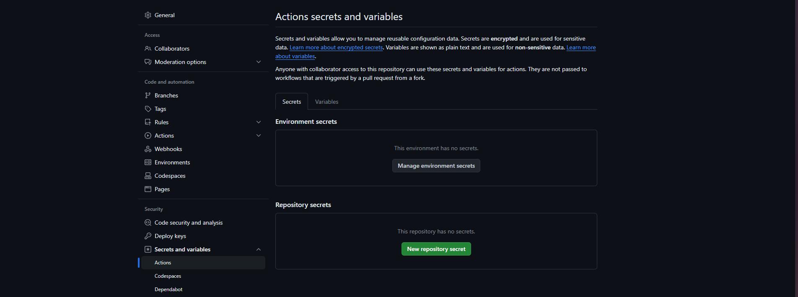

Note: To replicate the workflow, make change to the hardcoded repository names and their paths

Docker Image pushed on DockerHub:

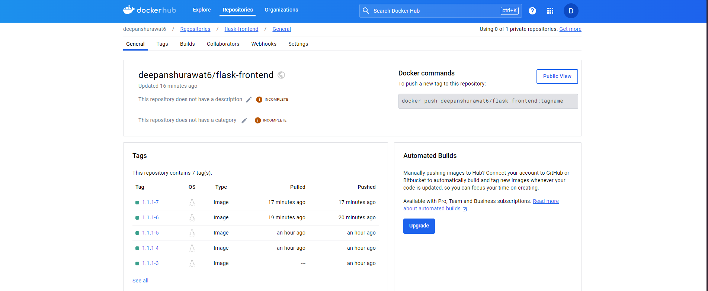

Updated configs-repository:

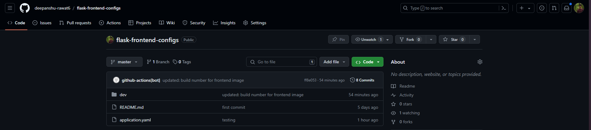

### 2.2 Deploy the Application Using Argo CD

With our application containerized, we modify the Kubernetes manifests in our Git repository to use the Docker image. We configure Argo CD to monitor our repository for changes and automatically deploy the application to our Kubernetes cluster.


Click for the [argo-configs](https://github.com/deepanshu-rawat6/flask-frontend-configs) repository.

The CI workflow will automatically update the deployments and rollouts, by chaning version numbers on the yaml file under `dev` directory in `flask-frontend-configs` repository.

But, first we need to setup the initial deployment of the application. To setup the initial deployment, we need to apply the `application.yaml` file by running the command:

```zsh
kubectl apply -f application.yaml
```

Here is the application.yaml file:

```yaml
apiVersion: argoproj.io/v1alpha1
kind: Application
metadata:
  name: frontend-serivce
  namespace: argocd
spec:
  project: default

  source:
    repoURL: https://github.com/deepanshu-rawat6/flask-frontend-configs.git
    targetRevision: HEAD
    path: dev
  destination:
    server: https://kubernetes.default.svc
    namespace: myapp

  syncPolicy:
    syncOptions:
      - CreateNamespace=true

    automated:
      selfHeal: true
      prune: true
```  

Here, the inital deployment setup:

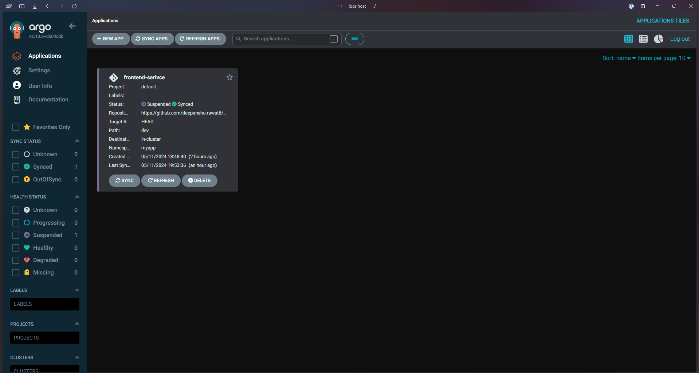

But as the CI is triggered by a push to the `flask-frontend-service` repository, in the ending steps, it triggers the CD workflow.

The CD workflow applies [frontend-deployment](https://github.com/deepanshu-rawat6/flask-frontend-configs/blob/master/dev/frontend-deployment.yaml) and [frontend-service](https://github.com/deepanshu-rawat6/flask-frontend-configs/blob/master/dev/frontend-service.yaml).

## 3. Implementing a Canary Release with Argo Rollouts <a name="implementing-a-canary-release-with-argo-rollouts"></a>

A Canary release is a deployment strategy used in software development and deployment where a new version of an application is gradually rolled out to a small subset of users or servers before being deployed to the entire infrastructure. This approach allows teams to test new features or changes in a real-world environment while minimizing the potential impact on the entire user base.

### 3.1 Define a Rollout Strategy

Argo Rollouts allows us to implement advanced deployment strategies, such as canary releases. We modify our application's deployment to use Argo Rollouts and define a canary release strategy in the rollout definition. This includes specifying the number of replicas and the percentage of traffic to be routed to the canary release.

For implementing a rollout strategy, we have used `frontend-rollout.yaml` manifest file:

```yaml
apiVersion: argoproj.io/v1alpha1
kind: Rollout
metadata:
  name: frontend-rollouts
spec:
  replicas: 5
  strategy:
    canary:
      steps:
        - setWeight: 20
        - pause: {}
        - setWeight: 40
        - pause: {duration: 10}
        - setWeight: 60
        - pause: {duration: 10}
        - setWeight: 80
        - pause: {duration: 10}
  revisionHistoryLimit: 2
  selector:
    matchLabels:
      app: rollouts-demo
  template:
    metadata:
      labels:
        app: rollouts-demo
    spec:
      containers:
        - name: frontend-rollout
          # image: 854171615125.dkr.ecr.us-east-1.amazonaws.com/deepanshurawat6-web-frontend:1.0.1
          image: deepanshurawat6/flask-frontend:1.1.1-8
          resources:
            requests:
              cpu: 500m
              memory: 0.5Gi
            limits:
              cpu: 1000m
              memory: 1Gi
          ports:
            - containerPort: 8082
```

Along with it's service manifest file : `frontend-rollout-service.yaml`

```yaml
apiVersion: v1
kind: Service
metadata:
  name: frontend-rollouts
spec:
  ports:
    - port: 8082
      targetPort: 8082
  selector:
    app: frontend-rollouts

```

### 3.2 Trigger a Rollout

Apply both manifest files initially by using the commands:

```zsh
kubectl apply -f frontend-rollout.yaml
kubectl apply -f frontend-rollout-service.yaml
```

Later, the CI/CD pipeline would automatically apply the changes in the manifest files.

Here, is the rollout configuration, we have been triggered by the CI/CD pipeline.

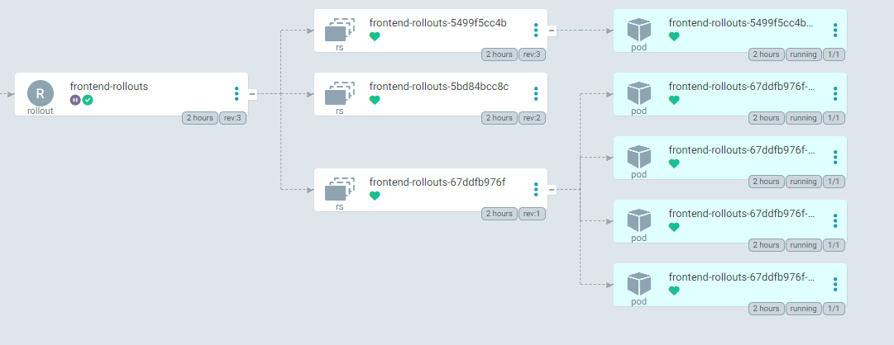

### 3.3 Monitor the Rollout

Throughout the rollout process, we use Argo Rollouts to monitor the deployment of the new version. We can track metrics and analyze user feedback to ensure that the canary release completes successfully without impacting our users.

To monitor the rollouts we can use the command:

```zsh
kubectl argo rollouts get rollout frontend-rollouts --watch
```

Here, is the view on the terminal:


To have more interactive view, we can again go to the dashboard. To open the dashboard, we can run the command.

```zsh
kubectl argo rollouts dashboard
```

Here, the dashboard, after the triggered rollout:

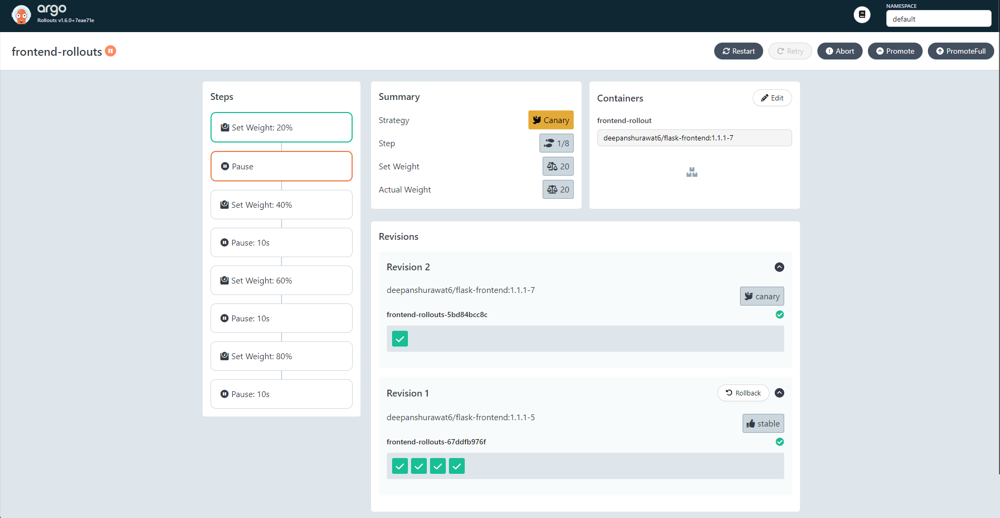

On the K9s dashboard, we see the `frontend-rollouts` under the `default` namespace:

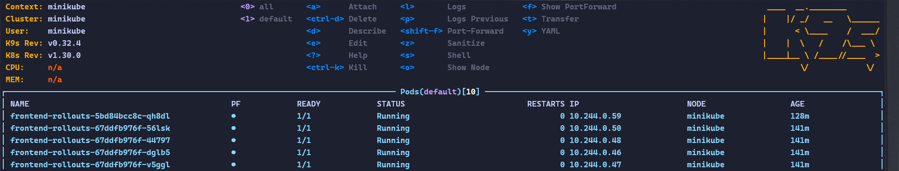

## 4. Documentation and Cleanup <a name="documentation-and-cleanup"></a>

### 4.1 Clean Up

Finally, we provide instructions on how to clean up all the resources created during the assignment from our Kubernetes cluster. This ensures that we don't incur any unnecessary costs and that our cluster remains clean and organized.

To apply clean up, we can run the command:

```zsh
kubectl delete --all
```

## Conclusion

Setting up a GitOps pipeline using Argo CD and Argo Rollouts allows us to automate the deployment and management of our applications in Kubernetes. By following these steps, we can streamline our development process, improve deployment reliability, and deliver features to our users more efficiently. Whether you're a seasoned developer or new to Kubernetes, this documentation should help you get started with GitOps practices.
